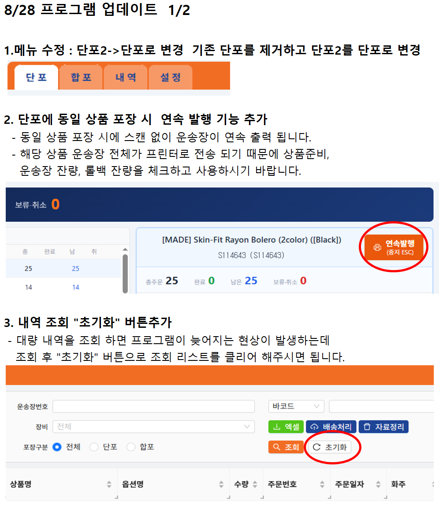
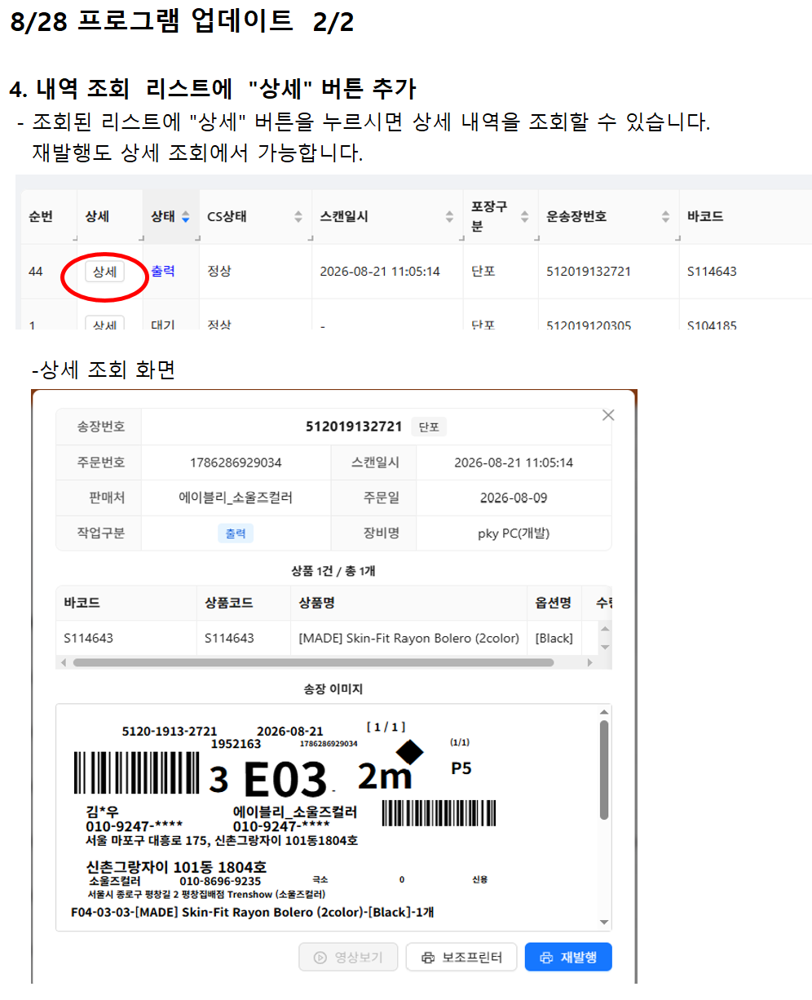

# SpeedBagger 1.6.0 업데이트 안내

| 항목 | 내용 |
|---|---|
| 앱 | v1.5.13 → v1.6.0 |
| 배포일 | 2026-08-27 |

## 단포

**(중요) 단포 탭이 새 화면으로 교체됩니다.** 기존 단포 화면은 숨기고, 상품 목록·운송장 목록·작업완료 이력 3단 화면이 「단 포」 탭이 됩니다. 앱을 켜면 이 탭으로 들어갑니다.

**연속발행이 추가됩니다.**
- 상품을 고르고 「연속발행」을 누르면 그 상품의 대기 운송장이 순서대로 자동 출력됩니다. 인쇄 성공을 확인한 건만 완료 처리됩니다.
- ESC 를 누르면 중지됩니다. 확인창이 겹쳐 떠서 "0건 발행" 이 반복되던 문제도 함께 고쳤습니다.
- 연속발행은 포장 영상을 저장하지 않습니다 (아래 「공통」 참고).

**스캔 중 동작**
- 처리 중에 다시 스캔하면 조용히 무시하지 않고 경고창을 띄웁니다.
- 오류창은 Enter 나 ESC 로만 닫힙니다. 스캐너가 연달아 보내는 문자가 오류창을 닫고 입력창으로 새어 들어가던 문제를 막은 것입니다.
- 서버 응답이 느릴 때 라벨은 나갔는데 실패로 표시되던 경우가 줄어듭니다 (상태 전송 대기 시간을 3초에서 30초로 늘림).

**집계 표시**
- 다른 포장기가 처리한 건의 상태 이름이 "다른포장기" 에서 "타기기" 로 바뀌고 회색으로 표시됩니다. 재조회할 때마다 진척 배너 숫자가 되돌아가던 문제를 고쳤습니다.

## 합포

- 취소·이상(CS) 상품은 상품 스캔 대조와 완료 판정에서 빠집니다. 화면 집계와 같은 기준이 됩니다.
- 처리 중 재스캔 경고, 오류창 Enter/ESC 닫기는 단포와 같습니다.
- 재발행 미리보기를 닫으면 스캔 입력창으로 포커스가 돌아옵니다.

## 내역

**상세창이 생깁니다.**
- 순번 옆 「상세」 버튼을 누르면 송장번호(합포는 전체)·주문번호·스캔일시·판매처·주문일·작업구분·장비명과 상품 목록이 뜹니다. 합포는 페이지에 보이지 않던 상품까지 전부 보입니다.
- 상세창 아래에 「재발행」「보조프린터」「영상보기」 버튼이 있습니다. 출력 중에는 두 출력 버튼이 함께 잠겨 중복 발행을 막습니다.
- 목록에 있던 재발행·보조프린터·녹화 열은 상세창으로 옮겨 사라집니다.

**영상보기**: 녹화 기능을 쓰는 업체는 상세창에서 그 운송장의 포장 영상을 바로 재생할 수 있습니다. 영상이 없으면 버튼이 비활성입니다.

**초기화 버튼**: 조회 조건·결과·건수·페이지·정렬을 처음 상태로 되돌립니다. 서버 데이터는 지우지 않습니다 (삭제는 「자료정리」).

**고친 것**
- 페이지당 건수를 바꾸면 그 조회부터 바로 적용됩니다. 전에는 한 번은 이전 건수로 조회됐습니다.
- 스캔일시 열에 상품 수정 시각이 섞여 보이던 것을 고쳐 실제 스캔 시각만 표시합니다. 값이 없으면 "-" 입니다.

## 설정

**「녹화」 탭이 새로 생깁니다.** (영상 저장 사용 업체)
- 영상 저장 켜기/끄기, 카메라 선택, 저장 폴더, 보관 기간(최대 60일), 스캔후 최소·최대 녹화 시간, 압축 켜기/끄기, 화질과 프레임레이트, 디스크 여유 공간 기준을 설정합니다.
- 「실시간 화면 보기」로 카메라 각도와 화질을 확인할 수 있습니다. 보는 동안은 녹화가 멈추며 확인창·상단 배너·하단바로 계속 알려줍니다. 3분이 지나면 자동으로 닫힙니다.
- 카메라가 지원하는 해상도를 조회해 권장·미지원을 표시합니다.

**장비 설정**
- 설정 화면이 열릴 때 프린터 목록을 기다리느라 멈춰 있던 지연을 없앴습니다. 프린터 목록은 뒤에서 채워집니다.
- 장비 번호 조회에 실패했을 때 로딩이 끝나지 않던 문제를 고쳤습니다.
- **(중요)** 메인보드가 고유 번호를 갖지 않는 조립 PC 에서 두 번째 장비부터 등록이 막히던 문제를 고쳤습니다. 이미 그런 PC 로 등록해 쓰고 있던 장비는 이번 업데이트 후 장비 번호가 달라져 재등록·재승인이 필요합니다. 해당 현장에는 따로 안내합니다.
- 설정 저장 위치가 Windows 계정별 폴더에서 PC 공용 폴더로 옮겨집니다. 한 포장대를 여러 계정으로 써도 같은 설정을 봅니다.

## 어드민설정

- 장비 설정을 저장할 때 비활성 장비가 다시 활성으로 바뀌던 문제를 고쳤습니다.
- 송하인 주소 입력창에 필수 항목 검사가 들어갑니다.
- API 계정을 바꾸면 화주·판매처 목록이 초기화됩니다.
- 저장 실패 시 오류 메시지가 다시 표시됩니다 (4개 화면). 버튼 더블클릭으로 두 번 전송되던 것을 막았습니다.

## 공통

**운송장별 포장 영상 녹화 기능이 추가됩니다.** (영상 저장 사용 업체)
- 운송장을 스캔한 순간부터 다음 운송장을 스캔할 때까지를 한 클립으로 저장합니다. 스캔 직후 최소 녹화 시간은 보장되고, 다음 스캔이 없으면 최대 녹화 시간에서 끝납니다.
- 실패한 스캔, 이미 출력된 운송장의 재스캔, 연속발행은 저장하지 않습니다. 메인프린터 재발행은 다시 담는 작업이므로 저장하고, 보조프린터는 사본 출력이라 저장하지 않습니다.
- 저장 폴더가 USB 나 외장 HDD 라도 클립 시각이 밀리지 않습니다. 압축과 이동은 스캔이 멈춘 틈에 뒤에서 처리합니다.
- 녹화가 스캔·인쇄 속도를 떨어뜨리지 않도록 낮은 우선순위로 돕니다.
- 저장 공간 부족, 전달 지연 등 조치가 필요한 상황은 하단바 고정 문구로 알리고, 실제로 녹화가 멈출 때만 팝업을 한 번 띄웁니다.
- 하단바에 「녹화중」 배지와 저장 완료 표시가 나옵니다.

**인쇄 안정화**
- 7월 중순 Edge 자동 업데이트(150 버전) 이후 송장 인쇄용 브라우저가 뜨지 않아 인쇄가 되지 않던 문제를 고쳤습니다. 앱 버전과 무관한 환경 변화였습니다.
- 인쇄 브라우저가 반복해서 죽어 좀비로 쌓이면 앱을 재시작해도 인쇄가 안 되던 문제를 고쳤습니다. 연속발행 중 인쇄 브라우저가 죽으면 스스로 복구합니다.
- 인쇄가 60초 넘게 멈추면 끊고 다음 작업을 받습니다.

**앱 안정화**
- 앱을 두 번 실행하면 새 창 대신 기존 창이 앞으로 나옵니다. 종료가 걸려 프로세스가 남던 문제를 고쳤습니다.
- 서버 연결이 끊기면 자동으로 다시 연결합니다.

**소리**: 완료음이 두 배 커집니다.

## 거래처공지

2026-08-28 발송.

